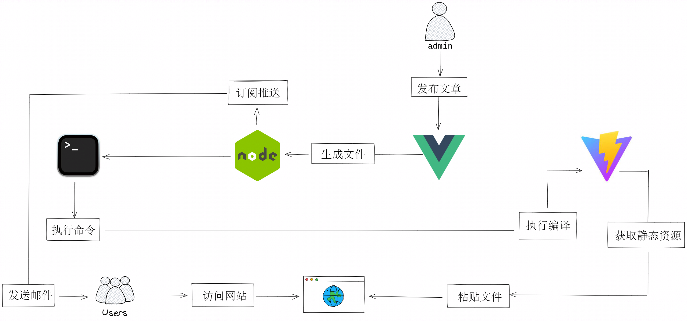

# 记录专区

[**Project**](https://github.com/orgs/greatest-work/projects/2)

[**Team**](https://github.com/orgs/greatest-work/teams/greatest-work)

# Greatest work 食用说明

本项目分为三部分，分别是 `admin: 负责管理文章` 、`blog: 用于打包生成静态网页`、`server: 负责后台`

## 操作背景
- MySQL
- Node
- Linux
- Vue
- 宝塔
- VitePress
